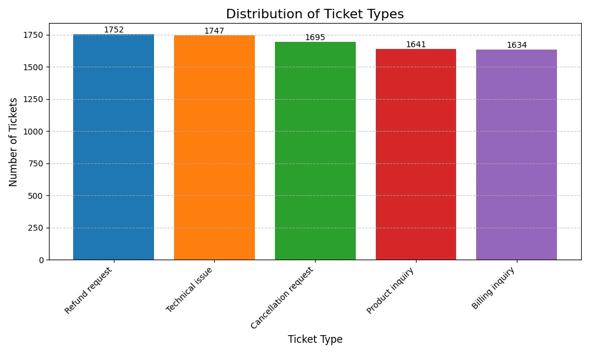
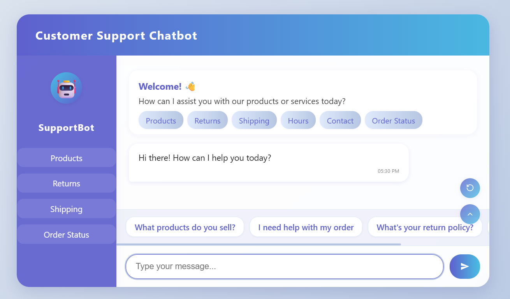
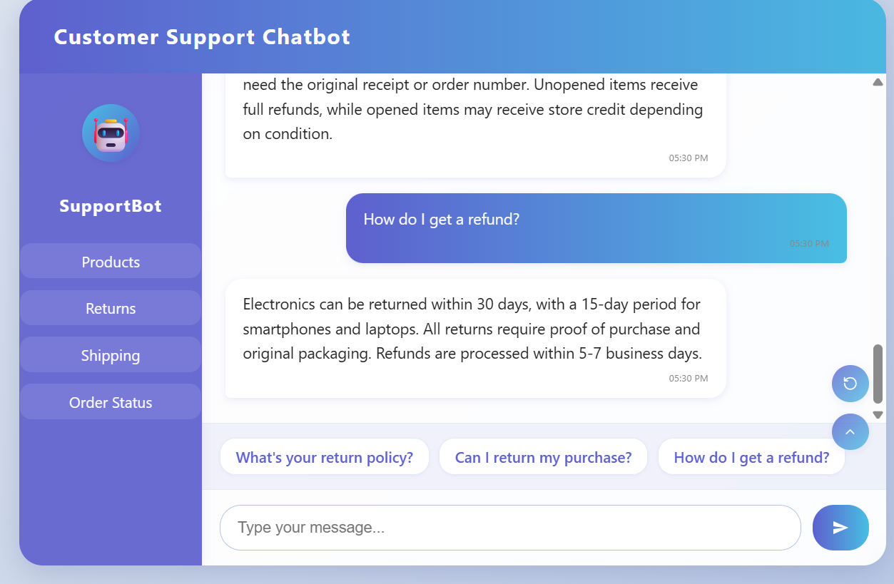

# 📈 Task 3 – Build A ChatBot for Customer Support

I made a Custom Chatbot for Customer Support using FAQ Data available in Kaggle for my Machine Learning Internship at **Future Interns**

---

## 📊 Dataset
- **Source**: [Stock Market Dataset](https://www.kaggle.com/datasets/waseemalastal/customer-support-ticket-dataset)

---

## 🎯 Objective
A Pretrained ChatBot that can resolve Customer Queries using available FAQ Data and generate help and relevent answers at real time for quick help.

---

## 🧰 Tools Used

- **Python**
- **Flask**
- **HTML5 / CSS3 / JavaScript**
- **Pandas**
- **Matplotlib**
- **Jupyter Notebook** 

---

## 📸 Visuals

### Customer Satisfaction Distribution


### Query Distribution


### Chatbot



---
## Folder Structure

```
FUTURE_ML_03/
│
├── visualization/
|   ├── images/
|   │   ├── chatbot-home.png
|   |   ├── chatbot-interaction.png
|   ├── customer_satisfaction_distribution.png
|   ├── query_distribution.png
│   └── visualization.ipynb 
│
├── data/
|   ├── customer_support_tickets.csv
│   └── intents.json
│
├── templates/
│   └── index.html
│
├── chatbot.py
├── README.md
└── requirements.txt
```

---

## How to Run

1. Clone the repository:
   ```bash
   git clone https://github.com/yourusername/FUTURE_ML_03.git
   ```

2. Install the dependencies:
   ```bash
   pip install -r requirements.txt
   ```

3. ⚠️ Recommended Python version:
    ```bash
    This project was developed and tested using Python 3.9.0.
    Using the same version is recommended for compatibility.
    ```

4. Run the application:
   ```bash
   python chatbot.py
   ```

5. Open your browser and navigate to:
   ```
   http://127.0.0.1:5000/
   ```

---

## Customization

### Adding New Intents
Update the `intents.json` file to add new conversation patterns:

```json
{
  "tag": "new_intent",
  "patterns": [
    "Your new pattern 1",
    "Your new pattern 2"
  ],
  "responses": [
    "Your new response 1",
    "Your new response 2"
  ]
}
```

---

